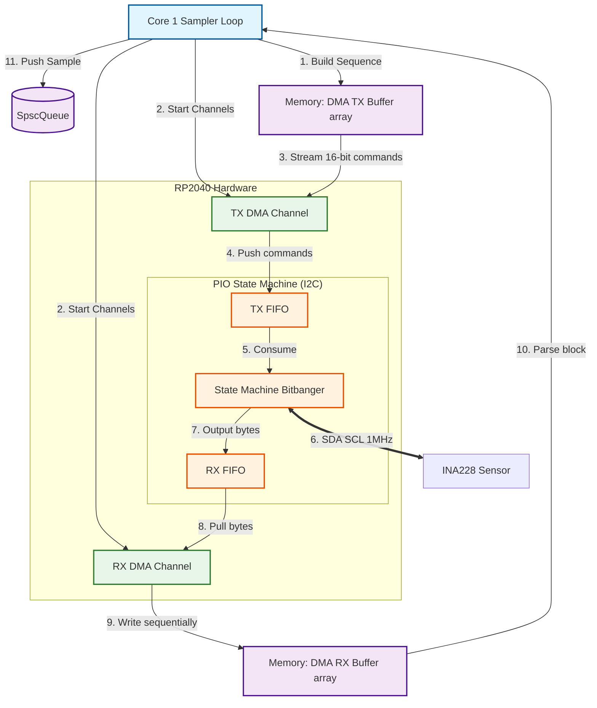
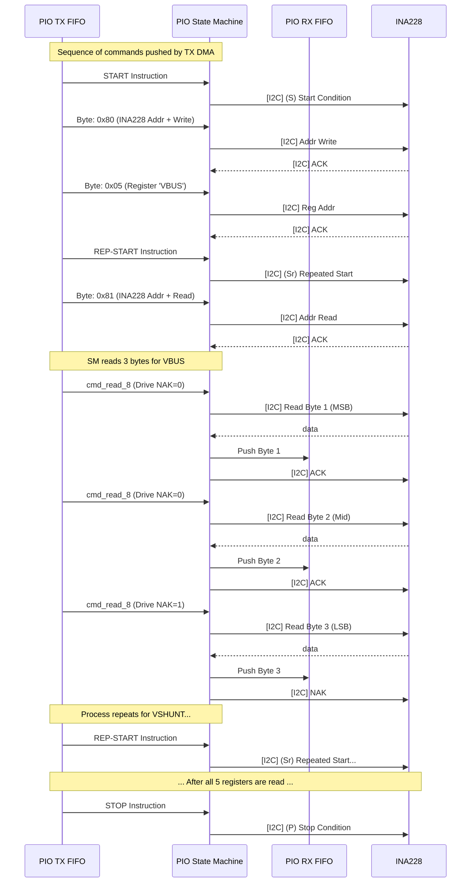
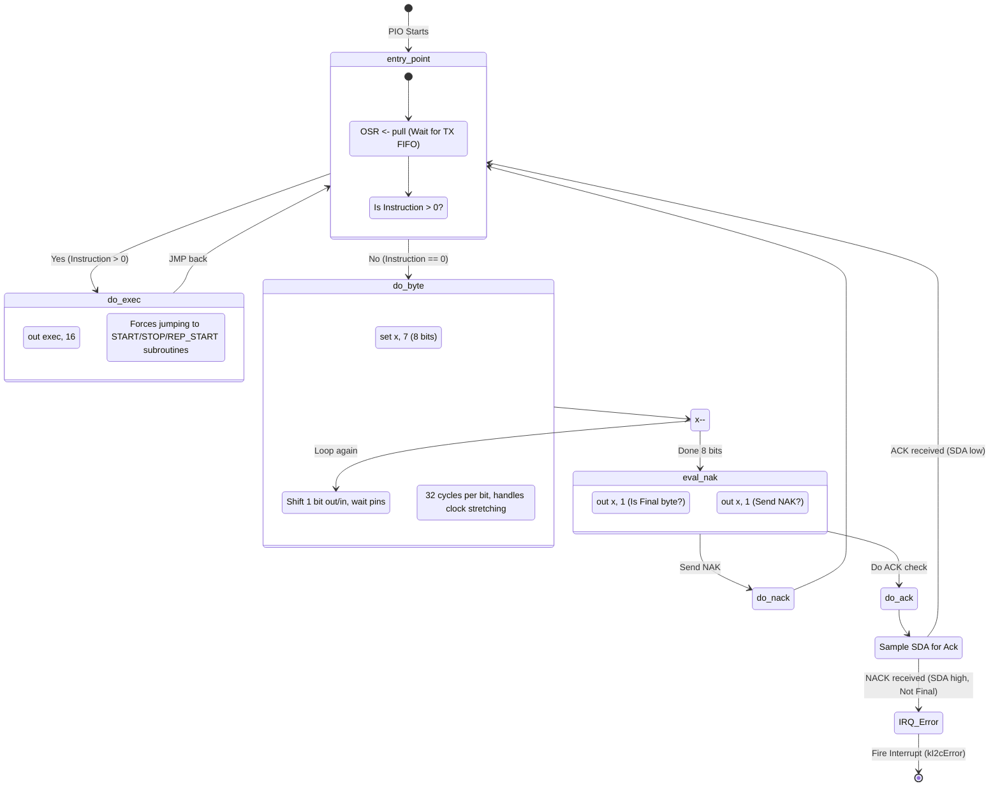

# Power Monitor: PIO DMA Architecture

This document outlines the architecture of the PIO DMA I2C system used in the Power Monitor for querying the INA228 sensor at high speeds (1MHz) without CPU overhead.

## 1. DMA Hardware Architecture (Data Flow)

The system uses standard Pico hardware blocks combined into a zero-CPU-wait pipeline. Core 1 simply triggers the pipeline and retrieves a parsed result later.

## 2. I2C Bus Sequence (Register Polling)

To poll 5 target INA228 registers consecutively (VBUS, VSHUNT, DIETEMP, CURRENT), we load a sequence of I2C commands into the DMA TX buffer. The sequence uses the **repeated-start** instruction between reads rather than full STOPs to save bus time and adhere to standard I2C register-read protocols.

## 3. I2C Physical Layer Basics (High/Low Levels & ACK/NAK)

Before diving into the state machine, here is a quick refresher on how the PIO drives the I2C physical layer:

*   **Open-Drain Bus:** The SCL and SDA lines are connected to VCC via pull-up resistors. Devices on the bus **never actively drive the line HIGH (1).** They only pull the line **LOW (0)** to ground, or "release" the line (setting their pin to input/High-Z) to let the resistor pull it HIGH (1).
*   **Clock Stretching:** If the slave (INA228) needs more time to process, it will hold SCL LOW. The master (Pico PIO) checks the SCL pin state before continuing; if it's still LOW despite the master releasing it, the master waits (`wait 1 pin, 1`).
*   **Data Validity:** SDA must be stable while SCL is HIGH. SDA is only allowed to change state when SCL is LOW.
*   **START/STOP Conditions:** These are the only exceptions to the data validity rule.
    *   **START (S):** SDA transitions HIGH to LOW while SCL is HIGH.
    *   **STOP (P):** SDA transitions LOW to HIGH while SCL is HIGH.

### The ACK / NAK Mechanism
After every 8 bits (one byte) transferred, there is a **9th clock pulse** dedicated to the Acknowledge bit.
*   **ACK (0 / LOW):** The receiver pulls SDA LOW during the 9th clock pulse to say "I received the byte successfully."
*   **NAK (1 / HIGH):** The receiver leaves SDA released (pulled HIGH) during the 9th clock pulse.
    *   If the Master is writing and sees NAK, it means the slave is busy, doesn't exist, or didn't understand.
    *   If the Master is reading, the **Master must send a NAK** after the *last byte* it wants to read. This tells the slave "Stop sending data, I'm done."

This explains why our DMA array generator explicitly sets `cmd_read_8` with the `NAK` bit set to `1` on the final byte of each register read sequence.

## 4. PIO State Machine Transition Logic

The core PIO I2C bitbanger acts as a simple processor handling commands fetched from the `TX FIFO`. A command word is 16 bits: `[15:10 Instruction | 9 Final | 8:1 Data | 0 NAK]`.

If `Instruction > 0`, it executes internal instructions (like `set` or `jmp` for START/STOP templates). If `Instruction == 0`, it shifts out the data byte.

## 5. Summary of 10ms Fix
The initial DMA benchmark ran incredibly slow (~10.3ms loop iteration) because of an explicit call to `pio_i2c_wait_idle` after the RX DMA finished.

Because the RX DMA finishes the exact microsecond the *last data byte* is received (which corresponds to the 28th byte pushed to RX FIFO), the PIO still needs to fetch the final `STOP Instruction` from the TX FIFO and execute it on the bus. This takes `~1.2us`.

However, `pio_i2c_wait_idle` contains a `10,000us` hardcoded timeout. The timing race condition caused the PIO to sometimes appear "Not Idle" to the CPU context for an instant, triggering an internal loop condition that hit the 10,000us limit and errored out.

Instead, our DMA approach totally removes the CPU wait loop. The CPU is completely unblocked the moment DMA is finished, and the PIO hardware executes the STOP asynchronously in the background in 1.2us, yielding an astounding **311us** end-to-end benchmark result.
