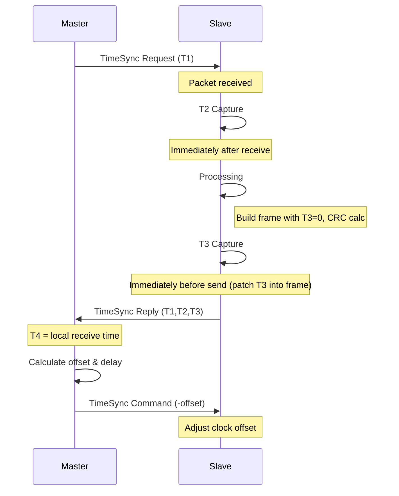
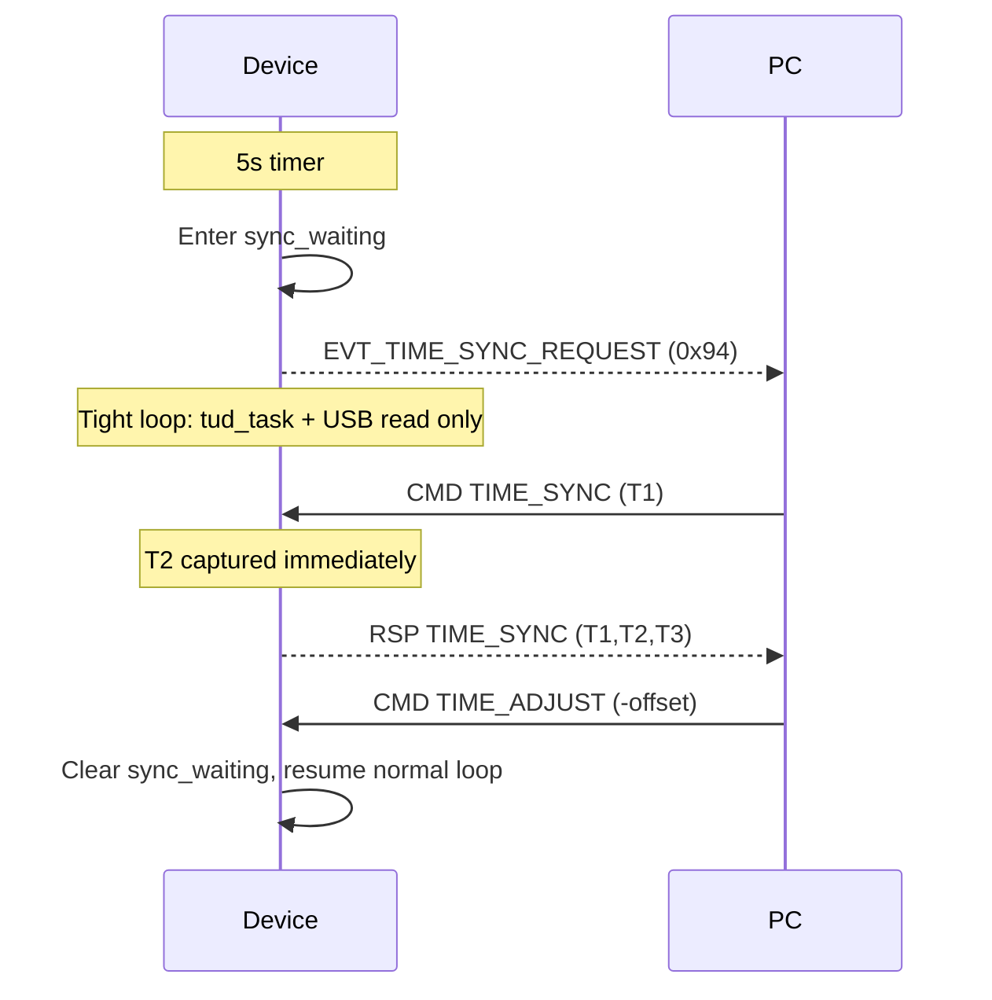

# Time Synchronization Protocol Documentation

> **Note**: Complete protocol specification (frame format, MSGID definitions, payload structures) is documented in [uart_protocol.md](../protocol/uart_protocol.md) Section 5.2. This document focuses on the synchronization algorithm, timing considerations, and implementation details.

Related code:
- `device/command_handler.hpp`
- `device/protocol/frame_defs.hpp`

This document describes the time synchronization protocol implemented between a host computer (Master) and a Raspberry Pi Pico device (Slave) over a serial connection.

## Overview

The protocol synchronizes device time with host PC time using **real Unix time** (system_clock), not monotonic/relative clocks. This is critical because:
- PC's `steady_clock` is relative to process start (different origin than device)
- Device's `time_us_64()` is relative to device boot
- Only `system_clock` provides a common time reference

**Synchronization Flow**:
1. **TIME_SET (0x07)**: PC sends current Unix time → Device sets `epoch_offset = unix_time - monotonic_time`
2. **Fine-tuning via DATA_SAMPLE**: PC compares `device_timestamp_unix_us` with its own `system_clock` time → calculates drift → sends TIME_ADJUST

The protocol uses the unified UART frame format (see [uart_protocol.md](../protocol/uart_protocol.md)) with the following MSGIDs:
- `TIME_SET (0x07)`: Set absolute Unix time (initial sync)
- `TIME_SYNC (0x05)`: NTP-style sync request (legacy, not recommended after TIME_SET)
- `TIME_ADJUST (0x06)`: Apply clock offset correction
- `EVT_TIME_SYNC_REQUEST (0x94)`: Device → PC event; device asks PC to run the sync flow (see Device-driven sync)

## Protocol Flow

### Phase 1: Initial Sync (TIME_SET)

1. **Master** gets current Unix time from `system_clock`
2. **Master** sends `TIME_SET (unix_time_us)` to device
3. **Device** calculates: `epoch_offset = unix_time_us - monotonic_time`
4. **Device** stores `epoch_offset` and syncs to shared context for Core 1

```
PC system_clock: 1772004726902781 us (≈ 2026-02-25)
Device monotonic: 207796693952 us (device uptime ~57 hours)
epoch_offset = 1772004726902781 - 207796693952 = 1771796930193829 us
```

Now `device_timestamp_unix_us = monotonic_time + epoch_offset` = correct Unix time!

### Phase 2: Fine-tuning (TIME_SYNC with Unix time)

After TIME_SET, the NTP-style TIME_SYNC works correctly if PC also uses Unix time:

1. **PC** sends `TIME_SYNC` with T1 = `system_clock.now()` (Unix time)
2. **Device** responds with T2, T3 (both are Unix time = monotonic + epoch_offset)
3. **PC** calculates using Unix time algorithm:
   - delay = (T4 - T1) - (T3 - T2)
   - offset = (T2 - T1 + T3 - T4) / 2
4. **PC** sends `TIME_ADJUST(-offset)` to correct drift

```
Example:
  T1 (PC send):    1772005000000000 (Unix)
  T2 (Device recv): 1772005000015000 (Unix)  ← includes device delay
  T3 (Device send): 1772005000015500 (Unix)
  T4 (PC recv):     1772005000030000 (Unix)

  delay = (3000 - 0) - (500 - 1500) = 3000 - (-1000) = 4000 us
  offset = (15000 - 0 + 15500 - 3000) / 2 = 27500 / 2 = 13750 us
  → Send TIME_ADJUST(-13750) to correct 13.75ms drift
```

1. **Master** generates a timestamp T1 and sends a Time Sync Request
2. **Slave** receives the request at timestamp T2
3. **Slave** generates timestamp T3 and sends a Time Sync Reply with T1, T2, T3
4. **Master** receives the reply at timestamp T4 (locally calculated)
5. **Master** calculates:
   - Network delay: `delay = (T4 - T1) - (T3 - T2)`
   - Clock offset: `offset = ((T2 - T1) + (T3 - T4)) / 2`
6. **Master** sends a Time Sync Command with the negative offset
7. **Slave** adjusts its clock by adding the received offset

### Sequence Diagram



## Special Commands

- Use `TIME_SET (0x07)` to set the absolute Unix time on the device (replaces the old seq=0 special case)
- The device maintains a global epoch offset (`epoch_offset_us`) that is adjusted with each `TIME_ADJUST` command

## Timestamp Types in DATA_SAMPLE

The device sends two types of timestamps in each `DATA_SAMPLE` frame:

### Relative Timestamp (timestamp_us)
- **Definition**: Microseconds since stream start (`now - stream_start_us`)
- **Precision**: High - based on device's monotonic clock, no sync error accumulation
- **Usage**: Calculate actual sampling intervals, detect jitter/dropouts

### Absolute Timestamp (timestamp_unix_us)
- **Definition**: Unix timestamp (microseconds since epoch), computed as `monotonic_time + epoch_offset_us`
- **Precision**: Depends on sync accuracy (typically 10-100μs after sync)
- **Usage**: Align with other data sources (e.g., ILLIXR modules), absolute time comparison

### Rationale

| Timestamp Type | Advantage | Use Case |
|---------------|-----------|----------|
| Relative (`timestamp_us`) | No sync error, stable interval calculation | Jitter analysis, dropout detection |
| Absolute (`timestamp_unix_us`) | Direct alignment with PC/external data | Multi-source correlation, BOXR research |

### Protocol Change

The `DATA_SAMPLE` payload will be extended to include both timestamps:

```
Original (16 bytes):
  timestamp_us (4 bytes) + flags (2 bytes) + vbus20 (3 bytes) + vshunt20 (3 bytes) + current20 (3 bytes) + dietemp16 (2 bytes)

Proposed (24 bytes):
  timestamp_us (4 bytes) + timestamp_unix_us (8 bytes) + flags (2 bytes) + vbus20 (3 bytes) + vshunt20 (3 bytes) + current20 (3 bytes) + dietemp16 (2 bytes)
```

Note: The 4-byte `timestamp_us` is kept for backward compatibility; new `timestamp_unix_us` (8 bytes) is added.

## Error Handling

- CRC16/CCITT-FALSE calculation ensures data integrity (see [uart_protocol.md](../protocol/uart_protocol.md) for frame format)
- Frame validation uses the unified protocol's SOF (0xAA, 0x55) and CRC mechanism
- Timeout handling with retries ensures robust operation
- Consecutive error counting prevents system flooding during connection issues

## Implementation Notes

### Master Side (Host)
- Should use a monotonic clock to track time consistently
- Should log all transactions for debugging and analysis
- Should implement error recovery strategies

### Slave Side (C++ on Pico)
- Maintains an epoch offset (`epoch_offset_us`) that is adjusted with each `TIME_ADJUST` command
- Validates all incoming packets with CRC checks using the unified protocol's CRC-16/CCITT-FALSE
- Uses low-level serial I/O for efficient communication

### Timing Precision Considerations

**T2 Capture Timing**:
- T2 should be captured immediately after frame parsing completes
- In the current architecture, frames are parsed by `Parser` before reaching `CommandHandler::handle_frame()`
- Therefore, T2 capture happens at the start of `handle_time_sync()`, which includes parser processing delay
- Typical parser delay: 10-50 microseconds (depends on frame size and system load)
- For higher precision, consider capturing T2 in the parser callback (requires architecture changes)

**T3 Capture Timing**:
- T3 should be captured immediately before the serial write operation
- This minimizes the time between T3 capture and actual transmission
- T3 is **not included in CRC calculation** - this allows T3 to be patched into the frame after CRC is computed without requiring a second CRC calculation
- Implementation: T3 is set to 0 during frame build (CRC calculated with T3=0), then T3 is patched into the frame at offset 27 just before sending

## Device-Driven Sync Mode

To reduce time-sync latency, the device can request the PC to run the sync flow:

1. **Device** sends `EVT_TIME_SYNC_REQUEST (0x94)` every 2 minutes while streaming (no payload).
2. **Device** enters a tight USB-only loop: only `tud_task()` and USB read/parser run; streaming and stats are skipped so T2/T3 capture has minimal jitter.
3. **PC** receives the event (e.g. via `pop_wait` on the response queue) and immediately sends `TIME_SYNC (T1)`, then `TIME_ADJUST (-offset)` after the reply.
4. **Device** exits the tight loop when it processes `TIME_ADJUST` (sync complete) or after a timeout (e.g. 200 ms).

### Trade-off: Sample Loss vs Sync Latency

**Why skip streaming during sync?**
- If `process_streaming()` is called during sync_waiting, USB bandwidth is shared between data samples and time sync frames
- This increases T2/T3 jitter, reducing sync precision
- Therefore, streaming is paused during sync to prioritize sync accuracy

**Consequence:**
- 1 data sample is lost per 2-minute sync cycle (~0.002% loss at 1kHz)
- This is acceptable for most use cases (99.998% data integrity)
- If zero sample loss is required, implement parallel USB endpoints (one for data, one for control)

### Multi-Round Sync with Minimum Offset Selection

To improve sync accuracy and filter out outliers, the PC performs multiple sync rounds and selects the minimum offset:

**Initial Sync (device startup):**
- Runs 10 rounds of TIME_SYNC
- Collects all valid offsets
- Applies the **minimum offset** at the end
- After 3 seconds from sync start, rejects any offset >1000μs (outlier filtering)

**Periodic Sync (every 2 minutes):**
- Runs 3 rounds of TIME_SYNC
- Collects all valid offsets
- Applies the **minimum offset** at the end
- Continues filtering outliers >1000μs after initial sync

**Rationale:**
- NTP typically uses minimum offset rather than average because the path delay is asymmetric
- Taking the minimum offset provides the most accurate clock correction
- Filtering outliers prevents single bad measurements from corrupting the epoch_offset

### Device-Driven Sequence



### Timeout Behaviour

- If the PC does not respond within the device timeout (e.g. 200 ms), the device clears `sync_waiting` and resumes the normal main loop (streaming, stats).
- Old PC clients that do not handle `EVT_TIME_SYNC_REQUEST` simply ignore the event; the device times out and continues normally.

## Usage Recommendations

1. Run synchronization at regular intervals (e.g., every second)
2. Log offset values to monitor system stability
3. Consider environmental factors that might affect timing precision
4. For critical applications, implement a sliding window average of offsets

## Performance Characteristics

- Typical precision: 10-100 microseconds
- Affected by serial connection quality and system load
- More frequent synchronization improves stability but increases overhead
