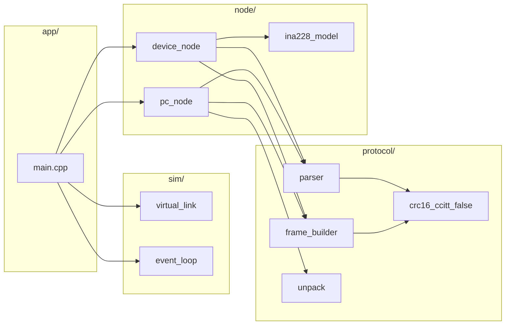

# hardware info

## parts
[Adafruit Feather RP2040 x1](https://learn.adafruit.com/adafruit-feather-rp2040-pico)

[adafruit ina228](https://learn.adafruit.com/adafruit-ina228-i2c-power-monitor)

## prototype 

# setup guide

## prepare
```
git clone -b master https://github.com/raspberrypi/pico-sdk.git
cd pico-sdk
git submodule update --init
```
Set PICO_SDK_PATH to this folder in your environment.
## if you are using windows
install this  zadig driver in order to flash
https://zadig.akeo.ie/
## build
```
mkdir build
cd build
cmake ..
make
```
## flash
Flash to Pico

Hold BOOTSEL while plugging in the Pico → mounts as RPI-RP2.

Drag & drop the generated .uf2 file.

[ref](https://datasheets.raspberrypi.com/pico/getting-started-with-pico.pdf)

# pc program
timesync.py
pip install pyserial

# pc protocol simulator (host-only)

This repository now includes a PC-side protocol simulator that runs entirely on the host
without Pico SDK dependencies. It includes a virtual serial link, protocol parser/builder,
device-side INA228 behavior simulation, and a demo event loop that exercises PING/SET_CFG/STREAM.

## build (host, no pico sdk)
```
g++ -std=c++17 -I. \
  app/main.cpp \
  protocol/crc16_ccitt_false.cpp \
  protocol/frame_builder.cpp \
  protocol/parser.cpp \
  protocol/unpack.cpp \
  sim/event_loop.cpp \
  sim/virtual_link.cpp \
  node/ina228_model.cpp \
  node/pc_node.cpp \
  node/device_node.cpp \
  -o pc_sim
```

## build (cmake, host)
```
cmake -S pc_sim -B build_pc
cmake --build build_pc --target pc_sim
```

## run
```
./pc_sim
```

## adjust link fault injection
Edit `app/main.cpp` to change `LinkConfig` fields such as `min_chunk`, `max_chunk`,
`min_delay_us`, `max_delay_us`, `drop_prob`, and `flip_prob`.

## adjust waveform parameters
Edit `node/ina228_model.cpp` to change default voltage/current/temperature waveforms.

## architecture diagrams (PC simulator)

### module layout


### runtime data flow
```mermaid
sequenceDiagram
    participant Loop as EventLoop
    participant PC as PCNode
    participant Link as VirtualLink
    participant Dev as DeviceNode

    Loop->>PC: tick(now_us)
    PC->>Link: write(CMD frame)
    Loop->>Link: pump(now_us)
    Link->>Dev: bytes arrive
    Loop->>Dev: tick(now_us)
    Dev->>Dev: parser.feed(bytes)
    Dev->>Link: write(RSP/EVT/DATA)
    Loop->>Link: pump(now_us)
    Link->>PC: bytes arrive
    Loop->>PC: tick(now_us)
    PC->>PC: parser.feed(bytes)
```

### frame handling pipeline
```mermaid
flowchart TD
    In[Incoming bytes] --> Parser[parser.feed()]
    Parser -->|CRC OK| Frame[Frame object]
    Parser -->|CRC fail| Drop[Drop + count]
    Frame --> PCDispatch[PC/Device dispatch]
    PCDispatch --> CFG[CFG_REPORT handler]
    PCDispatch --> DATA[DATA_SAMPLE handler]
    PCDispatch --> RSP[RSP handler]
```
