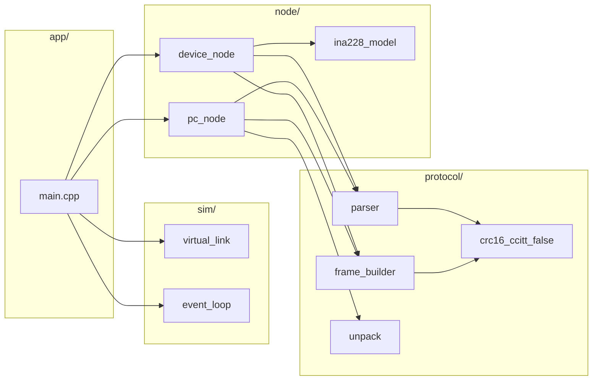

# pc protocol simulator (host-only)

This repository now includes a PC-side protocol simulator that runs entirely on the host
without Pico SDK dependencies. It includes a virtual serial link, protocol parser/builder,
device-side INA228 behavior simulation, and a demo event loop that exercises PING/SET_CFG/STREAM.


## build (cmake, host)
```
cmake -S pc_sim -B build_pc
cmake --build build_pc --target pc_sim
```

## run
```
./pc_sim
```

## test documentation

See [docs/pc_simulator_tests.md](docs/pc_simulator_tests.md) for detailed information about:
- What the simulator tests
- Test scenario breakdown (PING, SET_CFG, STREAM_START/STOP)
- Communication quality metrics
- Fault injection configuration
- How to interpret results

## adjust link fault injection
Edit `app/main.cpp` to change `LinkConfig` fields such as `min_chunk`, `max_chunk`,
`min_delay_us`, `max_delay_us`, `drop_prob`, and `flip_prob`.

## adjust waveform parameters
Edit `node/ina228_model.cpp` to change default voltage/current/temperature waveforms.

## architecture diagrams (PC simulator)

### module layout


### runtime data flow
```mermaid
sequenceDiagram
    participant Loop as EventLoop
    participant PC as PCNode
    participant Link as VirtualLink
    participant Dev as DeviceNode

    Loop->>PC: tick(now_us)
    PC->>Link: write(CMD frame)
    Loop->>Link: pump(now_us)
    Link->>Dev: bytes arrive
    Loop->>Dev: tick(now_us)
    Dev->>Dev: parser.feed(bytes)
    Dev->>Link: write(RSP/EVT/DATA)
    Loop->>Link: pump(now_us)
    Link->>PC: bytes arrive
    Loop->>PC: tick(now_us)
    PC->>PC: parser.feed(bytes)
```

### frame handling pipeline
```mermaid
flowchart TD
    In[Incoming bytes] --> Parser[parser.feed()]
    Parser -->|CRC OK| Frame[Frame object]
    Parser -->|CRC fail| Drop[Drop + count]
    Frame --> PCDispatch[PC/Device dispatch]
    PCDispatch --> CFG[CFG_REPORT handler]
    PCDispatch --> DATA[DATA_SAMPLE handler]
    PCDispatch --> RSP[RSP handler]
```


## adjust link fault injection
Edit `app/main.cpp` to change `LinkConfig` fields such as `min_chunk`, `max_chunk`,
`min_delay_us`, `max_delay_us`, `drop_prob`, and `flip_prob`.

## adjust waveform parameters
Edit `node/ina228_model.cpp` to change default voltage/current/temperature waveforms.
