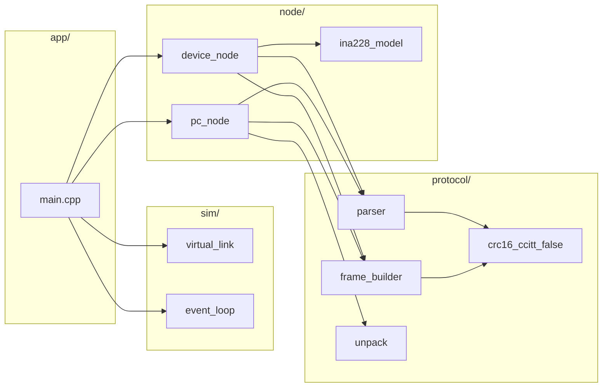

# Power Monitor

A power monitoring system based on the INA228 current/voltage/power sensor and Raspberry Pi Pico (RP2040), featuring a custom UART communication protocol with PC-side simulator for development and testing.

## Features

- **INA228 Sensor Driver** - Full-featured driver for RP2040 platform
- **Robust Protocol** - UART-based with CRC16-CCITT-FALSE error detection
- **Reliable Delivery** - Automatic retransmission and timeout handling
- **High-Speed Streaming** - Configurable sample rates up to 10kHz
- **PC Simulator** - Host-only simulator with fault injection for protocol testing
- **Comprehensive Testing** - Google Test suite with 6 test scenarios
- **Virtual Link** - Simulate packet loss, bit flips, delays, and fragmentation

## Hardware

- **MCU**: Raspberry Pi Pico (RP2040) / Adafruit Feather RP2040
- **Sensor**: Texas Instruments INA228 (I2C power monitor)
- **Interface**: USB CDC (UART over USB)

## Project Structure

```
powermonitor/
├── app/                # Demo applications
│   └── main.cpp        # PC simulator demo
├── device/             # Raspberry Pi Pico firmware
│   ├── INA228.cpp/hpp  # INA228 sensor driver
│   ├── powermonitor.cpp # Main device firmware
│   └── CMakeLists.txt  # Pico SDK build configuration
├── pc_sim/             # PC-side simulator and tests
│   └── CMakeLists.txt  # Host build with app/ or Google Test
├── protocol/           # Protocol implementation (shared by device & PC)
│   ├── crc16_ccitt_false.cpp
│   ├── frame_builder.cpp
│   ├── parser.cpp
│   └── unpack.cpp
├── sim/                # Simulation infrastructure
│   ├── event_loop.cpp  # Discrete event simulator
│   └── virtual_link.cpp # Virtual UART with fault injection
├── node/               # Protocol node implementations
│   ├── pc_node.cpp     # PC-side protocol logic
│   ├── device_node.cpp # Device-side protocol logic
│   └── ina228_model.cpp # INA228 behavior model
└── docs/               # Documentation
    ├── INA228_uart_protocol.md
    ├── pc_simulator_tests.md
    └── time_sync_documentation.md
```

## Quick Start

### Building PC Simulator (Host Only)

The PC simulator runs entirely on the host without Pico SDK dependencies.

```bash
# Option 1: Build demo application
cmake -S pc_sim -B build_pc
cmake --build build_pc --target pc_sim
./build_pc/pc_sim

# Option 2: Build Google Test suite
cmake -B build -S .
cmake --build build
./build/pc_sim/pc_sim_test
```

### Building Device Firmware

Requires [Pico SDK](https://github.com/raspberrypi/pico-sdk) installation.

```bash
cd device
cmake -B build
cmake --build build

# Flash to Pico (copy .uf2 file in BOOTSEL mode)
# The build output will be: build/powermonitor.uf2
```

## Testing

The project includes comprehensive tests using Google Test.

### Quick Test (Recommended)

Use the provided test script for one-command testing:

```bash
# Run tests (incremental build)
./test.sh

# Clean build and run tests
./test.sh --clean

# Verbose test output
./test.sh --verbose

# Show help
./test.sh --help
```

### Manual Testing

```bash
# Build and run all tests
cmake -B build -S .
cmake --build build
./build/pc_sim/pc_sim_test

# Or use CTest
cd build && ctest --verbose
```

### Test Suite Overview

| Test Case | Description |
|-----------|-------------|
| `PingCommand` | Basic connectivity validation |
| `SetConfiguration` | Configuration command handling |
| `StreamStartStop` | Data streaming lifecycle |
| `CompleteDataStreamingScenario` | End-to-end 10s data collection at 1kHz |
| `CommunicationWithPacketDrops` | Resilience to 5% packet loss |
| `CommunicationWithBitFlips` | Resilience to 1% bit error rate |

All tests verify protocol correctness under both normal and fault conditions.

**Expected output** (all tests passing):
```
[==========] Running 6 tests from 1 test suite.
[  PASSED  ] 6 tests.
Summary: crc_fail=0 data_drop=0 timeouts=0 retries=0
```

For detailed test documentation, see [docs/pc_simulator_tests.md](docs/pc_simulator_tests.md).

## Protocol Overview

The communication protocol uses byte-oriented framing with robust error detection.

### Frame Format

```
0x7E [payload] [CRC16-LSB] [CRC16-MSB] 0x7E
```

### Key Features

- **CRC16-CCITT-FALSE** for error detection
- **Sequence numbering** for reliable delivery
- **ACK/NACK responses** with automatic retransmission
- **Configurable timeouts** and retry limits
- **Message types**: CMD (commands), RSP (responses), EVT (events), DATA (samples)

For complete protocol specification, see [docs/INA228_uart_protocol.md](docs/INA228_uart_protocol.md).

## PC Tools

### Time Synchronization

Synchronize the device's internal clock with the PC.

```bash
pip install pyserial
python device/timesync.py
```

### Protocol Simulator Configuration

Edit `app/main.cpp` to configure simulation parameters:

#### Link Fault Injection

```cpp
sim::LinkConfig config;
config.min_chunk = 1;       // Minimum bytes per chunk
config.max_chunk = 16;      // Maximum bytes per chunk
config.min_delay_us = 0;    // Minimum transmission delay
config.max_delay_us = 2000; // Maximum transmission delay
config.drop_prob = 0.0;     // Packet drop probability (0.0-1.0)
config.flip_prob = 0.0;     // Bit flip probability (0.0-1.0)
```

**Example scenarios**:
- **Perfect link**: `drop_prob=0.0, flip_prob=0.0`
- **Noisy link**: `drop_prob=0.05, flip_prob=0.01`
- **Extreme stress**: `drop_prob=0.5, flip_prob=0.1`

#### Sensor Model Configuration

Edit `node/ina228_model.cpp` to customize simulated waveforms:
- Voltage patterns
- Current patterns
- Temperature curves

## Architecture

### Module Layout



### Runtime Data Flow

```mermaid
sequenceDiagram
    participant Loop as EventLoop
    participant PC as PCNode
    participant Link as VirtualLink
    participant Dev as DeviceNode

    Loop->>PC: tick(now_us)
    PC->>Link: write(CMD frame)
    Loop->>Link: pump(now_us)
    Link->>Dev: bytes arrive
    Loop->>Dev: tick(now_us)
    Dev->>Dev: parser.feed(bytes)
    Dev->>Link: write(RSP/EVT/DATA)
    Loop->>Link: pump(now_us)
    Link->>PC: bytes arrive
    Loop->>PC: tick(now_us)
    PC->>PC: parser.feed(bytes)
```

### Frame Handling Pipeline

```mermaid
flowchart TD
    In[Incoming bytes] --> Parser[parser.feed()]
    Parser -->|CRC OK| Frame[Frame object]
    Parser -->|CRC fail| Drop[Drop + count]
    Frame --> PCDispatch[PC/Device dispatch]
    PCDispatch --> CFG[CFG_REPORT handler]
    PCDispatch --> DATA[DATA_SAMPLE handler]
    PCDispatch --> RSP[RSP handler]
```

## Documentation

- **[INA228 UART Protocol](docs/INA228_uart_protocol.md)** - Complete protocol specification
- **[PC Simulator Tests](docs/pc_simulator_tests.md)** - Test scenarios and metrics
- **[Time Sync Documentation](docs/time_sync_documentation.md)** - Time synchronization details

## Development Tips

### Adjusting Sample Rates

In `app/main.cpp`:

```cpp
// High-speed sampling (10kHz)
pc.send_stream_start(100, 0x000F, loop.now_us());

// Standard sampling (1kHz)
pc.send_stream_start(1000, 0x000F, loop.now_us());

// Low-speed sampling (1Hz)
pc.send_stream_start(1000000, 0x000F, loop.now_us());
```

### Channel Selection

```cpp
// Voltage only
pc.send_stream_start(1000, 0x0001, loop.now_us());

// Voltage + Current
pc.send_stream_start(1000, 0x0003, loop.now_us());

// All channels (voltage, current, power, temperature)
pc.send_stream_start(1000, 0x000F, loop.now_us());
```

## License

See individual source files for license information.
