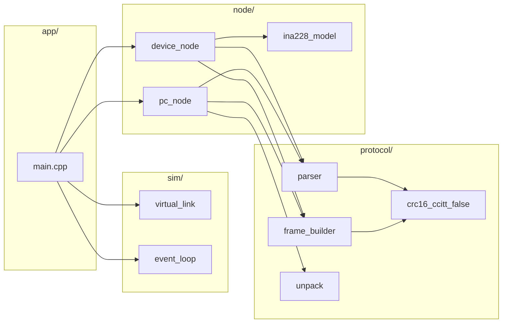

# Power Monitor

A power monitoring system based on the INA228 current/voltage/power sensor and Raspberry Pi Pico (RP2040), with a custom UART communication protocol and PC-side simulator for testing.

## Features

- INA228 sensor driver for RP2040
- Custom UART protocol with CRC16-CCITT-FALSE error detection
- Retransmission and timeout handling
- Real-time data streaming with configurable sample rates
- PC-side protocol simulator with fault injection capabilities
- Comprehensive test suite using Google Test

## Project Structure

```
powermonitor/
├── device/              # Raspberry Pi Pico firmware
│   ├── INA228.cpp/hpp  # INA228 sensor driver
│   ├── powermonitor.cpp # Main device firmware
│   └── CMakeLists.txt  # Pico SDK build configuration
├── pc_sim/             # PC-side simulator and tests
│   ├── main.cpp        # Google Test test suites
│   └── CMakeLists.txt  # Host build configuration with GTest
├── protocol/           # Protocol implementation
│   ├── crc16_ccitt_false.cpp
│   ├── frame_builder.cpp
│   ├── parser.cpp
│   └── unpack.cpp
├── sim/                # Simulation infrastructure
│   ├── event_loop.cpp  # Discrete event simulator
│   └── virtual_link.cpp # Virtual UART link with fault injection
├── node/               # Protocol node implementations
│   ├── pc_node.cpp     # PC-side protocol logic
│   ├── device_node.cpp # Device-side protocol logic
│   └── ina228_model.cpp # INA228 behavior model
└── docs/               # Documentation
    ├── INA228_uart_protocol.md
    └── time_sync_documentation.md
```

## Building

### PC Simulator and Tests

The PC simulator runs entirely on the host without Pico SDK dependencies.

```bash
# Configure and build
cmake -B build -S .
cmake --build build

# Run tests
./build/pc_sim/pc_sim_test

# Or use CTest
cd build && ctest --verbose
```

### Device Firmware

Requires Pico SDK installation.

```bash
cd device
cmake -B build
cmake --build build

# Flash to Pico
# Copy build/powermonitor.uf2 to your Pico in BOOTSEL mode
```

## test documentation

See [docs/pc_simulator_tests.md](docs/pc_simulator_tests.md) for detailed information about:
- What the simulator tests
- Test scenario breakdown (PING, SET_CFG, STREAM_START/STOP)
- Communication quality metrics
- Fault injection configuration
- How to interpret results

## adjust link fault injection
Edit `app/main.cpp` to change `LinkConfig` fields such as `min_chunk`, `max_chunk`,
`min_delay_us`, `max_delay_us`, `drop_prob`, and `flip_prob`.

## adjust waveform parameters
Edit `node/ina228_model.cpp` to change default voltage/current/temperature waveforms.

## architecture diagrams (PC simulator)

### module layout


### runtime data flow
```mermaid
sequenceDiagram
    participant Loop as EventLoop
    participant PC as PCNode
    participant Link as VirtualLink
    participant Dev as DeviceNode

    Loop->>PC: tick(now_us)
    PC->>Link: write(CMD frame)
    Loop->>Link: pump(now_us)
    Link->>Dev: bytes arrive
    Loop->>Dev: tick(now_us)
    Dev->>Dev: parser.feed(bytes)
    Dev->>Link: write(RSP/EVT/DATA)
    Loop->>Link: pump(now_us)
    Link->>PC: bytes arrive
    Loop->>PC: tick(now_us)
    PC->>PC: parser.feed(bytes)
```

### frame handling pipeline
```mermaid
flowchart TD
    In[Incoming bytes] --> Parser[parser.feed()]
    Parser -->|CRC OK| Frame[Frame object]
    Parser -->|CRC fail| Drop[Drop + count]
    Frame --> PCDispatch[PC/Device dispatch]
    PCDispatch --> CFG[CFG_REPORT handler]
    PCDispatch --> DATA[DATA_SAMPLE handler]
    PCDispatch --> RSP[RSP handler]
```


## Testing

The test suite includes:

- **PingCommand**: Basic connectivity test
- **SetConfiguration**: Configuration command validation
- **StreamStartStop**: Data streaming lifecycle
- **CompleteDataStreamingScenario**: End-to-end data collection
- **CommunicationWithPacketDrops**: Resilience to 5% packet loss
- **CommunicationWithBitFlips**: Resilience to 1% bit flips

All tests verify protocol correctness under both normal and fault conditions.

## PC Tools

### Time Synchronization

```bash
pip install pyserial
python device/timesync.py
```

### Protocol Simulator Configuration

Edit `pc_sim/main.cpp` to adjust simulation parameters:

- **LinkConfig**: Fault injection settings
  - `drop_prob`: Packet drop probability (0.0-1.0)
  - `flip_prob`: Bit flip probability (0.0-1.0)
  - `min_delay_us`, `max_delay_us`: Transmission delay range
  - `min_chunk`, `max_chunk`: Byte chunking for fragmentation

- **INA228 Model**: Edit `node/ina228_model.cpp` to change simulated voltage/current/temperature waveforms

## Protocol Overview

The communication protocol uses framed messages with the following features:

- Frame format: `0x7E [payload] [CRC16] 0x7E`
- CRC16-CCITT-FALSE error detection
- Sequence numbering for reliable delivery
- ACK/NACK responses with automatic retransmission
- Configurable timeout and retry mechanisms

See [docs/INA228_uart_protocol.md](docs/INA228_uart_protocol.md) for detailed protocol specification.

## Hardware

- **MCU**: Raspberry Pi Pico (RP2040) / Adafruit Feather RP2040
- **Sensor**: Texas Instruments INA228 (I2C power monitor)
- **Interface**: USB CDC (UART over USB)

## License

See individual source files for license information.
