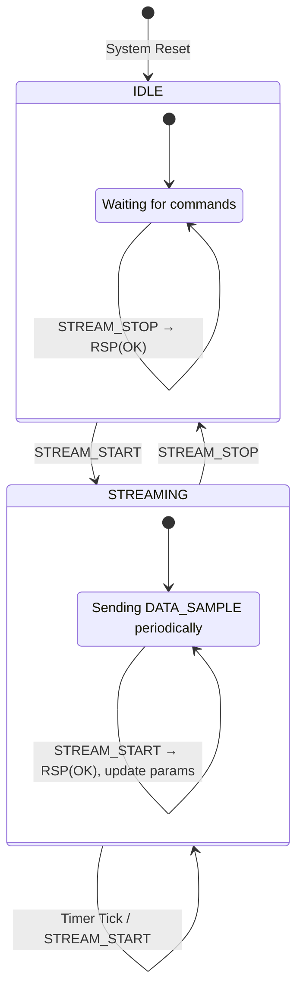

# Device-Side State Machine Design

This document outlines the design for the device-side (firmware) state machine based on the specifications in `uart_protocol.md` and `AGENTS.md`.

## Core States

The device's operation revolves around two primary states, determined by whether it is actively streaming data.

1.  **`IDLE`**
    *   **Description**: The default state after power-on or reset. In this state, the device listens for and responds to commands from the host (PC) but does not spontaneously send `DATA_SAMPLE` packets.
    *   **Entry Conditions**: System initialization/reset, or upon receiving a `STREAM_STOP` command.

2.  **`STREAMING`**
    *   **Description**: In this state, the device continuously samples data and sends `DATA_SAMPLE` frames to the host at the interval (`period_us`) and for the channels (`channel_mask`) specified by the `STREAM_START` command. It continues to listen for and respond to other commands.
    *   **Entry Conditions**: Receiving a valid `STREAM_START` command while in the `IDLE` state.

---

## State Transitions and Event Handling

The following table details how the state machine transitions and acts upon receiving commands or internal events.

| Current State | Event/Received Command | Actions | Next State | Response to Host |
| :--- | :--- | :--- | :--- | :--- |
| **`IDLE`** | `STREAM_START` (0x30) | 1. Parse and store `period_us` and `channel_mask`. 2. Reset the streaming timestamp accumulator to 0. 3. Start a periodic timer with the `period_us` interval. 4. Set `is_streaming = true`. | `STREAMING` | `RSP(OK)` |
| **`IDLE`** | `STREAM_STOP` (0x31) | 1. No action needed as streaming is already stopped. | `IDLE` | `RSP(OK)` |
| **`IDLE`** | `GET_CFG` (0x11) | 1. Read current internal configuration values. | `IDLE` | `RSP(OK)` + `CFG_REPORT` (0x91) |
| **`IDLE`** | `SET_CFG` (0x10) | 1. Update internal configuration registers. | `IDLE` | `RSP(OK)` + `CFG_REPORT` (0x91) |
| **`IDLE`** | `PING` (0x01) | 1. No action. | `IDLE` | `RSP(OK)` |
| | | | | |
| **`STREAMING`** | `STREAM_STOP` (0x31) | 1. Stop the periodic timer. 2. Set `is_streaming = false`. | `IDLE` | `RSP(OK)` |
| **`STREAMING`** | `STREAM_START` (0x30) | 1. Update `period_us` and `channel_mask`. 2. Reset the streaming timestamp accumulator to 0. 3. Reset (or reconfigure) the existing timer's period. | `STREAMING` | `RSP(OK)` |
| **`STREAMING`** | `Internal Timer Tick` | 1. Read sensor data from INA228. 2. Filter channels based on `channel_mask`. 3. Build `DATA_SAMPLE` frame and increment `data_seq`. 4. Send frame via UART. | `STREAMING` | `DATA_SAMPLE` (0x80) |
| **`STREAMING`** | `GET_CFG` (0x11) | 1. Read current internal configuration values. | `STREAMING` | `RSP(OK)` + `CFG_REPORT` (0x91) |
| **`STREAMING`** | `SET_CFG` (0x10) | 1. Update internal configuration registers (**should take effect immediately**). | `STREAMING` | `RSP(OK)` + `CFG_REPORT` (0x91) |
| **`STREAMING`** | `PING` (0x01) | 1. No action. | `STREAMING` | `RSP(OK)` |

**Notes**:
*   **Universal Commands**: Debugging commands like `REG_READ` (0x20) and `REG_WRITE` (0x21) should be handled in any state and do not affect the core `IDLE`/`STREAMING` state.
*   **Error Handling**: The protocol parser layer should handle low-level errors (CRC, framing, etc.) *before* the state machine. Invalid frames should be silently discarded (no `RSP(ERR_CRC)`), and unrecognized MSGIDs should be responded to with `RSP(ERR_UNK_CMD)` as per the protocol.

## State Machine Diagram (Mermaid)

## Implementation Suggestions

1.  **Parser**: The state machine should receive validated and parsed Command Objects from a lower-level `Parser` module, which handles SOF detection, header/payload parsing, and CRC verification.
2.  **Timer**: A hardware or software timer is required to precisely trigger data sampling in the `STREAMING` state. The timer's period must be configurable based on the `STREAM_START` command.
3.  **State Variable**: A simple `enum class DeviceState { IDLE, STREAMING };` or a boolean flag like `is_streaming` can be used to manage the current state clearly in code.
