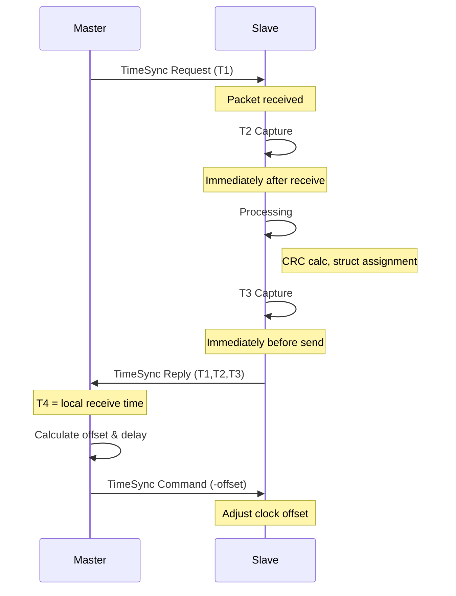
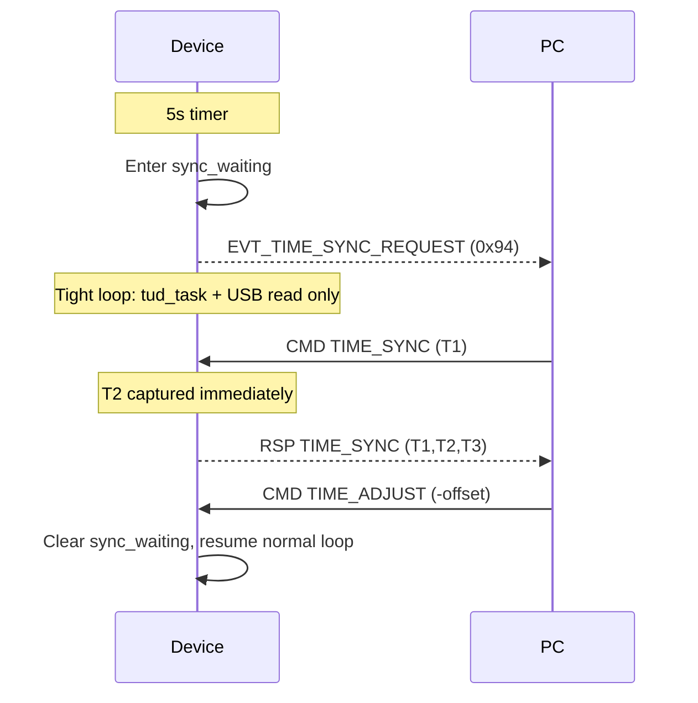

# Time Synchronization Protocol Documentation

> **Note**: Complete protocol specification (frame format, MSGID definitions, payload structures) is documented in [uart_protocol.md](../protocol/uart_protocol.md) Section 5.2. This document focuses on the synchronization algorithm, timing considerations, and implementation details.

Related code:
- `device/command_handler.hpp`
- `device/protocol/frame_defs.hpp`

This document describes the time synchronization protocol implemented between a host computer (Master) and a Raspberry Pi Pico device (Slave) over a serial connection.

## Overview

The protocol implements a precise time synchronization mechanism similar to NTP (Network Time Protocol) but optimized for serial connections. It allows the slave device to synchronize its clock with the master with microsecond precision.

The protocol uses the unified UART frame format (see [uart_protocol.md](../protocol/uart_protocol.md)) with the following MSGIDs:
- `TIME_SYNC (0x05)`: Initiate synchronization request
- `TIME_ADJUST (0x06)`: Apply clock offset correction
- `TIME_SET (0x07)`: Set absolute Unix time
- `EVT_TIME_SYNC_REQUEST (0x94)`: Device → PC event; device asks PC to run the sync flow (see Device-driven sync)

## Protocol Flow

1. **Master** generates a timestamp T1 and sends a Time Sync Request
2. **Slave** receives the request at timestamp T2
3. **Slave** generates timestamp T3 and sends a Time Sync Reply with T1, T2, T3
4. **Master** receives the reply at timestamp T4 (locally calculated)
5. **Master** calculates:
   - Network delay: `delay = (T4 - T1) - (T3 - T2)`
   - Clock offset: `offset = ((T2 - T1) + (T3 - T4)) / 2`
6. **Master** sends a Time Sync Command with the negative offset
7. **Slave** adjusts its clock by adding the received offset

### Sequence Diagram

## Special Commands

- Use `TIME_SET (0x07)` to set the absolute Unix time on the device (replaces the old seq=0 special case)
- The device maintains a global epoch offset (`epoch_offset_us`) that is adjusted with each `TIME_ADJUST` command

## Error Handling

- CRC16/CCITT-FALSE calculation ensures data integrity (see [uart_protocol.md](../protocol/uart_protocol.md) for frame format)
- Frame validation uses the unified protocol's SOF (0xAA, 0x55) and CRC mechanism
- Timeout handling with retries ensures robust operation
- Consecutive error counting prevents system flooding during connection issues

## Implementation Notes

### Master Side (Host)
- Should use a monotonic clock to track time consistently
- Should log all transactions for debugging and analysis
- Should implement error recovery strategies

### Slave Side (C++ on Pico)
- Maintains an epoch offset (`epoch_offset_us`) that is adjusted with each `TIME_ADJUST` command
- Validates all incoming packets with CRC checks using the unified protocol's CRC-16/CCITT-FALSE
- Uses low-level serial I/O for efficient communication

### Timing Precision Considerations

**T2 Capture Timing**:
- T2 should be captured immediately after frame parsing completes
- In the current architecture, frames are parsed by `Parser` before reaching `CommandHandler::handle_frame()`
- Therefore, T2 capture happens at the start of `handle_time_sync()`, which includes parser processing delay
- Typical parser delay: 10-50 microseconds (depends on frame size and system load)
- For higher precision, consider capturing T2 in the parser callback (requires architecture changes)

**T3 Capture Timing**:
- T3 should be captured immediately before the serial write operation
- This minimizes the time between T3 capture and actual transmission
- Ensure all processing (CRC calculation, struct assignment) is completed before capturing T3

## Device-Driven Sync Mode

To reduce time-sync latency, the device can request the PC to run the sync flow:

1. **Device** sends `EVT_TIME_SYNC_REQUEST (0x94)` every 5 seconds while streaming (no payload).
2. **Device** enters a tight USB-only loop: only `tud_task()` and USB read/parser run; streaming and stats are skipped so T2/T3 capture has minimal jitter.
3. **PC** receives the event (e.g. via `pop_wait` on the response queue) and immediately sends `TIME_SYNC (T1)`, then `TIME_ADJUST (-offset)` after the reply.
4. **Device** exits the tight loop when it processes `TIME_ADJUST` (sync complete) or after a timeout (e.g. 200 ms).

### Device-Driven Sequence

### Timeout Behaviour

- If the PC does not respond within the device timeout (e.g. 200 ms), the device clears `sync_waiting` and resumes the normal main loop (streaming, stats).
- Old PC clients that do not handle `EVT_TIME_SYNC_REQUEST` simply ignore the event; the device times out and continues normally.

## Usage Recommendations

1. Run synchronization at regular intervals (e.g., every second)
2. Log offset values to monitor system stability
3. Consider environmental factors that might affect timing precision
4. For critical applications, implement a sliding window average of offsets

## Performance Characteristics

- Typical precision: 10-100 microseconds
- Affected by serial connection quality and system load
- More frequent synchronization improves stability but increases overhead
