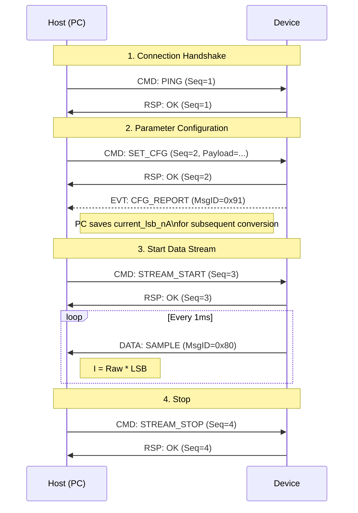
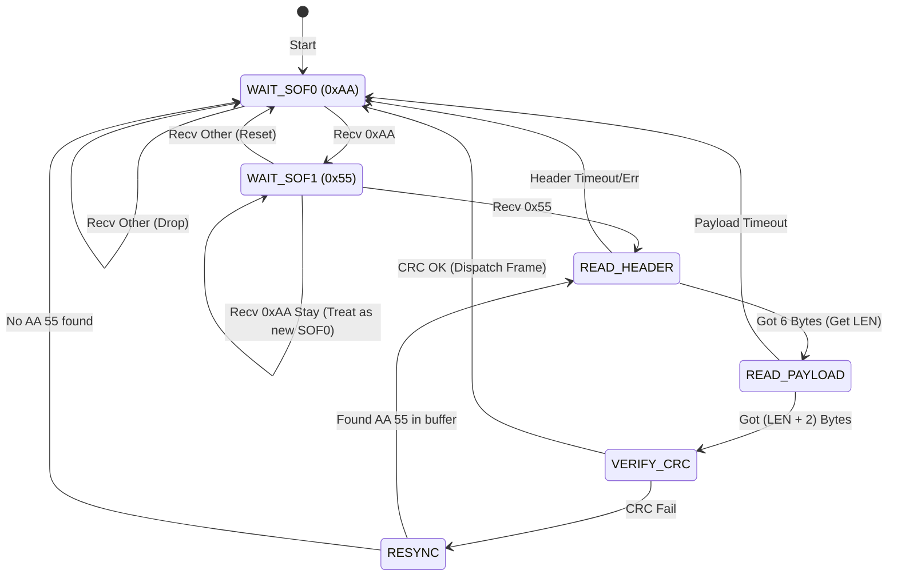

# INA228 USB-TTL Serial Communication Protocol Specification

Related code:
- `protocol/frame_builder.cpp`
- `protocol/parser.cpp`
- `protocol/unpack.cpp`
- `protocol/crc16_ccitt_false.cpp`

|||
|---|---|
|**Property**|**Content**|
|**Version**|v1.0 (Draft)|
|**Target Device**|Single INA228 Power Monitor Embedded Device|
|**Communication Link**|USB CDC (Virtual Serial) / UART|

## 1. Protocol Overview

This protocol is designed for high-speed sampling and configuration interaction between PC host and embedded devices.

### 1.1 Core Design Principles

- **Architecture**: Binary frame-based Request-Response model and asynchronous Streaming model.

- **Endianness**:

    - **Standard Integers** (`u16`, `u32`, `i16`): **Little-Endian**.

    - **20-bit Measurement Values**: Non-aligned data, stored as **LE-packed 3-byte** (low byte first).

- **Reliability**:

    - Control commands: With sequence number (SEQ) and acknowledgment (ACK/RSP).

    - Data stream: No ACK, relies on sequence number continuity to detect packet loss.


## 2. Frame Structure

Uses classic structure of **delimiter + header + payload + checksum**.

### 2.1 Frame Definition

|Offset|Field|Length|Description|Value/Range|
|---|---|---|---|---|
|0|**SOF0**|1|Start of Frame 0|`0xAA`|
|1|**SOF1**|1|Start of Frame 1|`0x55`|
|2|**VER**|1|Protocol Version|`0x01`|
|3|**TYPE**|1|Frame Type|See 2.2|
|4|**FLAGS**|1|Flag Bits|Bit0: ACK_REQ, Bit1: ACK|
|5|**SEQ**|1|Frame Sequence Number|0~255 (circular increment)|
|6|**LEN_L**|1|Payload Length Low Byte|N = 1 + DataLen|
|7|**LEN_H**|1|Payload Length High Byte|(includes MSGID)|
|8|**MSGID**|1|Message ID|See Chapter 3|
|9|**DATA**|N-1|Data Payload|Length = LEN - 1|
|8+N|**CRC_L**|1|CRC16 Checksum Low Byte|Algorithm: CRC-16/CCITT-FALSE|
|9+N|**CRC_H**|1|CRC16 Checksum High Byte|Range: `VER` to end of `DATA`|

> **LEN Field Description**: `LEN = sizeof(MSGID) + sizeof(DATA) = 1 + DataLen`
>
> **CRC Calculation Range**: From `VER`(offset 2) to end of `DATA`(offset 8+N-1), total `6 + N` bytes **CRC Parameters**: Poly=`0x1021`, Init=`0xFFFF`, RefIn=`False`, RefOut=`False`, XorOut=`0x0000`

### 2.2 Frame Type (TYPE)

|||||
|---|---|---|---|
|**TYPE**|**Macro**|**Direction**|**Description**|
|**0x01**|`CMD`|PC → Dev|Control command, usually requires response|
|**0x02**|`RSP`|Dev → PC|Command response, carries execution status|
|**0x03**|`DATA`|Dev → PC|Periodic sampling data stream (no ACK)|
|**0x04**|`EVT`|Dev → PC|Asynchronous event or configuration report|

### 2.3 Sequence Number (SEQ) Usage Rules

|Frame Type|SEQ Behavior|Description|
|---|---|---|
|**CMD**|Sender increments|PC maintains independent CMD sequence, 0→255 loop|
|**RSP**|Echo request SEQ|Device copies SEQ from corresponding CMD when responding|
|**DATA**|Device increments independently|Device maintains independent DATA sequence space for packet loss detection|
|**EVT**|Device increments independently|Shares sequence space with DATA|

**Packet Loss Detection Mechanism**:

- PC should record the SEQ of last received DATA frame
- If current SEQ ≠ (last SEQ + 1) % 256, packet loss is detected
- PC can log or request retransmission on packet loss (not enforced by protocol)

**Sequence Space Isolation**:

- CMD/RSP sequence space: PC-driven, for command confirmation
- DATA/EVT sequence space: Device-driven, for stream data integrity detection

## 3. Message ID Registry

||||||
|---|---|---|---|---|
|**MSGID**|**Name**|**Direction**|**Category**|**Description**|
|**0x01**|`PING`|P→D|Management|Heartbeat / Handshake|
|**0x02**|-|D→P|Management|(Reserved, generic response usually reuses CMD ID or independent)|
|**0x10**|`SET_CFG`|P→D|Configuration|Send parameters (triggers CFG_REPORT)|
|**0x11**|`GET_CFG`|P→D|Configuration|Query parameters (triggers CFG_REPORT)|
|**0x20**|`REG_READ`|P→D|Debug|Read INA228 register (supports 16/24/40 bit)|
|**0x21**|`REG_WRITE`|P→D|Debug|Write INA228 register (fixed 16 bit)|
|**0x30**|`STREAM_START`|P→D|Stream Control|Start streaming|
|**0x31**|`STREAM_STOP`|P→D|Stream Control|Stop streaming|
|**0x80**|`DATA_SAMPLE`|D→P|Data|Core sampling data (voltage/current raw values)|
|**0x90**|`EVT_ALERT`|D→P|Event|Hardware alert (Over-Voltage, etc.)|
|**0x91**|`CFG_REPORT`|D→P|Event|**Configuration report** (includes conversion coefficients)|

## 4. Common Response Mechanism

All CMD frames require RSP response, except DATA frames.

### 4.1 Common RSP Payload Structure

When TYPE = `0x02` (RSP):

```c
struct {
    uint8_t orig_msgid;  // MSGID of corresponding request
    uint8_t status;      // Execution status code
    uint8_t data[];      // (Optional) Additional return data, depends on specific command
} __attribute__((packed));
```

### 4.2 Status Code Definitions

||||
|---|---|---|
|**Value**|**Name**|**Description**|
|`0x00`|**OK**|Success|
|`0x01`|**ERR_CRC**|CRC verification failed (usually silently dropped, only reply in debug mode)|
|`0x02`|**ERR_LEN**|Invalid packet length|
|`0x03`|**ERR_UNK_CMD**|Unknown or unsupported MSGID|
|`0x04`|**ERR_PARAM**|Parameter out of range|
|`0x05`|**ERR_HW**|Hardware fault (e.g., I2C NACK)|

### 4.3 Error Handling Mechanism

#### 4.3.1 CRC Verification Failure

|Frame Type|Handling|Description|
|---|---|---|
|**DATA (0x03)**|Silently drop|High-frequency data stream, no reply to avoid congestion|
|**CMD (0x01)**|Reply `RSP(ERR_CRC)`|Notify PC to resend|
|**EVT (0x04)**|Silently drop|Device event, cannot request retransmission|

#### 4.3.2 Invalid Frame Length

|Frame Type|Handling|
|---|---|
|**DATA**|Silently drop|
|**CMD**|Reply `RSP(ERR_LEN)`|

#### 4.3.3 Unknown MSGID

|Frame Type|Handling|
|---|---|
|**DATA**|Silently drop|
|**CMD**|Reply `RSP(ERR_UNK_CMD)`|

#### 4.3.4 Timeout and Retransmission (Recommended Implementation)

This protocol does not enforce retransmission mechanism, but PC-side implementation is recommended:

```
CMD Timeout Handling:
1. Start timer after sending CMD (recommended 100~500ms)
2. Cancel timer upon receiving RSP with corresponding SEQ
3. Timeout without receiving RSP:
   - Retransmit same CMD (keep SEQ unchanged), max 3 retries
   - Report communication error after 3 failures

DATA Packet Loss Handling:
1. Record packet loss count when SEQ discontinuity detected
2. Reduce sampling frequency or check physical link when packet loss rate is too high
```

#### 4.3.5 Status Code Quick Reference

|Status Code|Trigger Condition|PC-side Recommended Action|
|---|---|---|
|`0x00 OK`|Command success|Process response data normally|
|`0x01 ERR_CRC`|CRC verification failed|Resend command|
|`0x02 ERR_LEN`|Invalid packet length|Check packet assembly logic|
|`0x03 ERR_UNK_CMD`|Unsupported MSGID|Check protocol version compatibility|
|`0x04 ERR_PARAM`|Parameter out of bounds|Check parameter range|
|`0x05 ERR_HW`|Hardware fault (I2C NACK, etc.)|Check hardware connection|

## 5. Detailed Payload Definitions

### 5.1 Data Stream & Configuration (Core & Config)

#### 5.1.1 DATA_SAMPLE (0x80)

- **Direction**: Dev → PC
- **Frame Type**: `DATA (0x03)`
- **Description**: Core high-frequency data. Transmits **raw register values** (Register >> 4), no floating-point calculation.

```c
struct DataSample {
    uint32_t timestamp_us;   // Relative timestamp (microseconds), see explanation below

    uint8_t  flags;          // Status flags:
                             //   Bit0: CNVRF  - ADC conversion complete
                             //   Bit1: ALERT  - Alert triggered
                             //   Bit2: CAL_VALID - Calibration valid (0 means CURRENT invalid)
                             //   Bit3: OVF    - Math overflow

    uint8_t  vbus20[3];      // VBUS unsigned 20-bit LE-packed
    uint8_t  vshunt20[3];    // VSHUNT signed 20-bit LE-packed
    uint8_t  current20[3];   // CURRENT signed 20-bit LE-packed
    int16_t  dietemp16;      // DIE_TEMP signed 16-bit

} __attribute__((packed));   // Total length: 4 + 1 + 3 + 3 + 3 + 2 = 16 bytes
```

**timestamp_us Description**:

|Feature|Description|
|---|---|
|**Origin**|Moment when `STREAM_START` command is executed, resets to 0|
|**Precision**|1 microsecond|
|**Range**|0 ~ 4,294,967,295 µs (approximately 71.6 minutes)|
|**Overflow Handling**|Natural wrap-around to 0, PC should detect and accumulate overflow count|

**PC-side Time Reconstruction Algorithm**:

```c
// State variables
uint32_t last_ts = 0;
uint64_t overflow_count = 0;

// Each time a frame is received
void on_data_sample(uint32_t ts_us) {
    if (ts_us < last_ts) {
        // Wrap-around detected
        overflow_count++;
    }
    last_ts = ts_us;
    
    // Absolute time (microseconds)
    uint64_t absolute_us = (overflow_count << 32) + ts_us;
}
```

> **Design Notes**: Benefits of using relative timestamp vs absolute timestamp:
>
> 1. Device doesn't need RTC or NTP synchronization
> 2. Time precision guaranteed by device local timer
> 3. PC can convert to local time as needed

#### 5.1.2 CFG_REPORT (0x91)

- **Direction**: Dev → PC
- **Frame Type**: `EVT (0x04)`
- **Trigger Conditions and Response Flow**:

|Trigger Scenario|Interaction Flow|
|---|---|
|Device Power-on|Device sends `CFG_REPORT` actively after initialization|
|`SET_CFG` Success|`RSP(OK)` → followed by `CFG_REPORT`|
|`GET_CFG` Request|`RSP(OK)` → followed by `CFG_REPORT`|
|Configuration Change (internal trigger)|Send `CFG_REPORT` actively|

> **Description**: Both `GET_CFG` and `SET_CFG` first reply with `RSP` to confirm command received, then return complete configuration through `CFG_REPORT`. This design benefits:
>
> 1. Maintains response model consistency (all CMD have RSP)
> 2. `CFG_REPORT` format is unified, PC only needs one parsing logic
>
> **Protocol Core**: Tells host how to convert RAW data to physical quantities.

```c
struct {
    uint8_t  proto_ver;       // Protocol version (0x01)
    
    uint8_t  flags;           // Bit0: streaming_on
                              // Bit1: cal_valid
                              // Bit2: adcrange (0=312.5nV, 1=78.125nV)

    uint32_t current_lsb_nA;  // Critical: Current LSB, unit nA (integer)
    
    uint16_t shunt_cal_reg;   // Actual SHUNT_CAL register value written (for reconciliation)
    uint16_t config_reg;      // Actual CONFIG
    uint16_t adc_config_reg;  // Actual ADC_CONFIG
    
    uint16_t stream_period_us;// Current streaming period
    uint16_t stream_mask;     // Streaming channel mask
} __attribute__((packed));
```

#### 5.1.3 SET_CFG (0x10)

- **Direction**: PC → Dev

```c
struct {
    uint16_t config_reg;      // INA228 CONFIG
    uint16_t adc_config_reg;  // INA228 ADC_CONFIG
    uint16_t shunt_cal;       // Target SHUNT_CAL
    uint16_t shunt_tempco;    // (Optional) Temperature coefficient
} __attribute__((packed));
```

- **Response**: First reply `RSP(OK)`, immediately followed by `CFG_REPORT(0x91)`.

#### 5.1.4 STREAM_START (0x30)

- **Direction**: PC → Dev

**CMD Payload**:

```c
struct StreamStartCmd {
    uint16_t period_us;      // Sampling period (microseconds), minimum depends on ADC configuration
    uint16_t channel_mask;   // Channel enable mask, see table below
} __attribute__((packed));
```

**channel_mask Bit Definitions**:

|Bit|Channel|Description|
|---|---|---|
|0|VBUS|Bus voltage|
|1|VSHUNT|Shunt voltage|
|2|CURRENT|Current (requires CAL_VALID)|
|3|DIETEMP|Die temperature|
|4~15|Reserved|Set to 0|

**Examples**:

- `0x000F`: Enable all 4 channels
- `0x0005`: Only VBUS + CURRENT
- `0x0001`: Only VBUS

**Response**: `RSP(OK)` then start pushing `DATA_SAMPLE`

> **Note**:
>
> - `period_us` should not be less than ADC conversion time, otherwise device will push at actual fastest speed
> - Disabled channels still occupy space in `DATA_SAMPLE` (filled with 0), maintaining fixed frame length

#### 5.1.5 GET_CFG (0x11)

- **Direction**: PC → Dev
- **Payload**: Empty (LEN = 1, only contains MSGID)

```c
// No additional parameters, only requests device to report current configuration
```

- **Response**: `RSP(OK)` + `CFG_REPORT(0x91)`

### 5.2 Debug Commands

#### 5.2.1 REG_READ (0x20)

- **Direction**: PC → Dev
- **Purpose**: Read INA228 register raw value (supports 16/24/40-bit registers)

**CMD Payload**:

```c
struct RegReadCmd {
    uint8_t ina_addr;   // INA228 I2C address (usually 0x40~0x4F)
    uint8_t reg_addr;   // Register address (0x00~0x0F)
    uint8_t reg_type;   // Register bit width type:
                        //   0 = 16-bit (CONFIG, SHUNT_CAL, etc.)
                        //   1 = 24-bit (VSHUNT, VBUS, CURRENT, POWER)
                        //   2 = 40-bit (ENERGY, CHARGE)
} __attribute__((packed));
```

**RSP Payload** (when Status = OK):

```c
struct RegReadRsp {
    uint8_t orig_msgid; // = 0x20
    uint8_t status;     // = 0x00 (OK)
    uint8_t reg_addr;   // Confirmed register address read
    uint8_t value[];    // Variable length data, Little Endian:
                        //   reg_type=0: 2 bytes
                        //   reg_type=1: 3 bytes
                        //   reg_type=2: 5 bytes
} __attribute__((packed));
```

**Register Bit Width Reference Table**:

|reg_type|Bit Width|Applicable Registers|
|---|---|---|
|0|16-bit|CONFIG (0x00), ADC_CONFIG (0x01), SHUNT_CAL (0x02), SHUNT_TEMPCO (0x03), DIAG_ALRT (0x0B), SOVL/SUVL/BOVL/BUVL/TEMP_LIMIT/PWR_LIMIT (0x0C~0x11), MANUFACTURER_ID (0x3E), DEVICE_ID (0x3F)|
|1|24-bit|VSHUNT (0x04), VBUS (0x05), DIETEMP (0x06), CURRENT (0x07), POWER (0x08)|
|2|40-bit|ENERGY (0x09), CHARGE (0x0A)|

#### 5.2.2 REG_WRITE (0x21)

- **Description**: INA228's writable registers (Configuration, Calibration, Limits, etc.) are all **16-bit**.

- **CMD Payload**:


```c
struct {
    uint8_t  ina_addr;
    uint8_t  reg_addr;
    uint16_t reg_value; // Fixed 16-bit write value
} __attribute__((packed));
```

## 6. Data Conversion Guide

After receiving `DATA_SAMPLE`, the host **must** combine parameters from the most recent `CFG_REPORT` to restore physical quantities.

### 6.1 20-bit Data Format Description

INA228's measurement registers (VSHUNT, VBUS, CURRENT, etc.) are 24-bit, where the high 20 bits are valid data and the low 4 bits are reserved.

**Data Source**:

```
Original register value (24-bit) >> 4 = 20-bit packed value
```

**Storage Format**: LE-packed 3 bytes, low byte first

```
Byte layout: [Bit7:0] [Bit15:8] [Bit19:16]
             buf[0]   buf[1]    buf[2]
```

**Sign Bit**: Bit 19 (MSB)

- Unsigned (VBUS): Use directly, range 0 ~ 0xFFFFF
- Signed (VSHUNT, CURRENT): Requires sign extension to 32-bit

### 6.2 20-bit Unpacking Algorithm

```c
// ===== Unsigned unpacking (VBUS) =====
uint32_t unpack_u20(const uint8_t buf[3]) {
    return (uint32_t)buf[0] | 
           ((uint32_t)buf[1] << 8) | 
           ((uint32_t)buf[2] << 16);
}

// ===== Signed unpacking (VSHUNT, CURRENT) =====
int32_t unpack_s20(const uint8_t buf[3]) {
    uint32_t raw = (uint32_t)buf[0] | 
                   ((uint32_t)buf[1] << 8) | 
                   ((uint32_t)buf[2] << 16);
    
    // Bit 19 is sign bit, extend to 32-bit
    if (raw & 0x80000) {
        raw |= 0xFFF00000;  // Sign extension
    }
    return (int32_t)raw;
}
```

### 6.3 Physical Quantity Calculation

|Physical Quantity|Data Type|Formula|Dependent Parameters|
|---|---|---|---|
|**Voltage (VBUS)**|Unsigned 20-bit|`V = unpack_u20(vbus20) * 195.3125e-6`|Fixed LSB = 195.3125 µV|
|**Shunt Voltage (VSHUNT)**|Signed 20-bit|`V = unpack_s20(vshunt20) * LSB_VSHUNT`|`adcrange=0`: 312.5 nV<br>`adcrange=1`: 78.125 nV|
|**Current (CURRENT)**|Signed 20-bit|`I = unpack_s20(current20) * current_lsb_nA * 1e-9`|`current_lsb_nA` from CFG_REPORT|
|**Temperature (DIE_TEMP)**|Signed 16-bit|`T = (int16_t)dietemp16 * 7.8125e-3`|Fixed LSB = 7.8125 m°C|

> **Note**: When `CFG_REPORT.flags.CAL_VALID = 0`, CURRENT value is invalid, host should ignore or display as N/A.

## 7. Sequence Diagrams

### 7.1 System Startup and Sampling Flow



# Appendix

PC-side Parser State Machine


