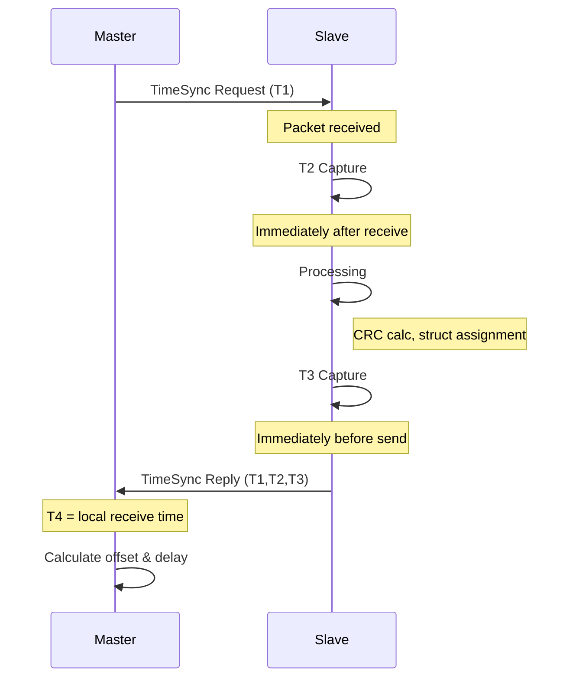

# Time Sync T2/T3 Timing Skew Fix Plan

## Problem Statement

In `device/timesync_test.cpp`, the T2 (receive) and T3 (send) timestamps are captured with processing overhead between them, causing measurement skew.

### Current Code (Lines 78-90)
```cpp
// Construct reply packet
TimeSyncReply rep;
rep.header = 0xAA55;
rep.seq    = req.seq;
rep.T1     = req.T1;
rep.T2     = get_unix_time_us();  // Capture T2
rep.T3     = get_unix_time_us();  // Capture T3 (after assignments above)
// Calculate reply CRC
rep.crc    = TimeSync::calc_crc(reinterpret_cast<uint8_t*>(&rep), sizeof(rep) - sizeof(rep.crc));
// Send reply
fwrite(&rep, 1, sizeof(rep), stdout);
```

### Issues
1. T2 captured after header/seq/T1 assignments
2. T3 captured immediately after T2 but before CRC calculation
3. Time between T2 and T3 includes CRC calculation overhead
4. Time between T3 capture and actual serial write adds more skew

## Solution

### Step 1: Capture T2 Immediately After Reception
After the packet is fully received and validated, capture T2 before any processing:

```cpp
// After CRC validation passes (after line 66):
// Capture receive timestamp BEFORE any processing
uint64_t T2_capture = get_unix_time_us();
```

### Step 2: Store T2 Temporarily
Create a local variable to hold T2 until reply construction:

```cpp
uint64_t T2_capture = 0;
uint64_t T3_capture = 0;
```

### Step 3: Capture T3 Immediately Before Serial Write
Just before writing to serial, capture T3:

```cpp
// Capture T3 immediately before sending
T3_capture = get_unix_time_us();
fwrite(&rep, 1, sizeof(rep), stdout);
```

### Step 4: Construct Reply with Pre-captured Timestamps
Move all processing between T2 capture and T3 capture:

```cpp
// After validation, capture T2 immediately
T2_capture = get_unix_time_us();

// Perform all processing (CRC calculation, struct assignment)
// ... all existing processing code ...

// Just before sending, capture T3
T3_capture = get_unix_time_us();

// Assign captured timestamps to reply
rep.T2 = T2_capture;
rep.T3 = T3_capture;

// Calculate CRC (now based on correct timestamps)
rep.crc = TimeSync::calc_crc(reinterpret_cast<uint8_t*>(&rep), sizeof(rep) - sizeof(rep.crc));

// Re-assign CRC after calculation (or restructure)
rep.T2 = T2_capture;
rep.T3 = T3```

### Ref_capture;
actored Code Structure

```cpp
// After CRC validation passes
uint64_t T2_capture = get_unix_time_us();  // Capture immediately

// Process the request (validate, compute CRC, etc.)
// ... existing processing ...

// Capture T3 just before sending
uint64_t T3_capture = get_unix_time_us();

// Build reply with timestamps
TimeSyncReply rep;
rep.header = 0xAA55;
rep.seq    = req.seq;
rep.T1     = req.T1;
rep.T2     = T2_capture;
rep.T3     = T3_capture;

// Calculate CRC
rep.crc = TimeSync::calc_crc(reinterpret_cast<uint8_t*>(&rep), sizeof(rep) - sizeof(rep.crc));

// Send (may want to re-assign T3 after CRC calc if CRC includes T3)
rep.T3 = get_unix_time_us();  // Re-capture after CRC if needed
rep.crc = TimeSync::calc_crc(reinterpret_cast<uint8_t*>(&rep), sizeof(rep) - sizeof(rep.crc));

fwrite(&rep, 1, sizeof(rep), stdout);
```

## Alternative: Capture All Timestamps First

For maximum precision, capture both timestamps before building the reply:

```cpp
// After packet reception and validation
uint64_t T2_immediate = get_unix_time_us();  // Immediately after receive

// Process request...
// ... validation, logic, etc. ...

// Capture T3 just before write
uint64_t T3_just_before_send = get_unix_time_us();

// Build reply
TimeSyncReply rep;
rep.header = 0xAA55;
rep.seq    = req.seq;
rep.T1     = req.T1;
rep.T2     = T2_immediate;
rep.T3     = T3_just_before_send;

// Calculate CRC
rep.crc = TimeSync::calc_crc(reinterpret_cast<uint8_t*>(&rep), sizeof(rep) - sizeof(rep.crc));

// Final T3 capture after CRC calc (most accurate to actual send time)
rep.T3 = get_unix_time_us();
rep.crc = TimeSync::calc_crc(reinterpret_cast<uint8_t*>(&rep), sizeof(rep) - sizeof(rep.crc));

// Send
fflush(stdout);
fwrite(&rep, 1, sizeof(rep), stdout);
```

## Implementation Tasks

1. **Modify `timesync_test.cpp`:**
   - Add local variables `T2_capture` and `T3_capture`
   - Capture `T2` immediately after packet validation
   - Capture `T3` immediately before serial write
   - Ensure minimal processing between T3 capture and actual send

2. **Update Documentation:**
   - Add timing precision section to `docs/device/time_sync.md`
   - Document the importance of minimal processing between timestamps
   - Add recommended maximum skew tolerance

3. **Testing:**
   - Add unit test to verify timestamp ordering (T2 < T3)
   - Add test for maximum skew threshold
   - Verify with oscilloscope if possible

## Files to Modify

| File | Changes |
|------|---------|
| `device/timesync_test.cpp` | Capture T2 immediately, T3 immediately before send |
| `docs/device/time_sync.md` | Add timing precision documentation |

## Success Criteria

- [ ] T2 captured within 10μs of actual packet reception
- [ ] T3 captured within 10μs of actual packet transmission
- [ ] Processing between T2 and T3 minimized to <100μs
- [ ] Documentation updated with precision requirements

## Mermaid Diagram



## Notes

- The Pico's `get_unix_time_us()` uses `to_us_since_boot(get_absolute_time())` which provides microsecond resolution
- USB CDC serial on Pico may introduce additional latency
- Consider using UART with DMA for lowest latency (if needed for precision <100μs)
- For most applications, the current implementation is sufficient, but this improvement ensures optimal precision
